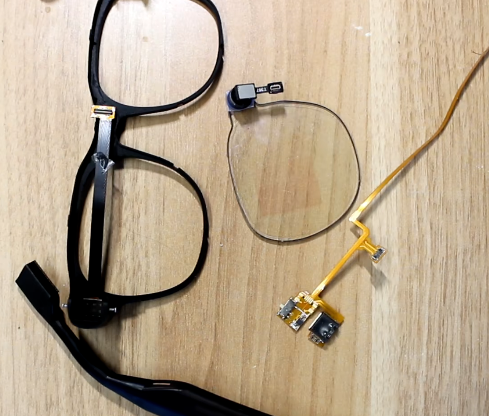
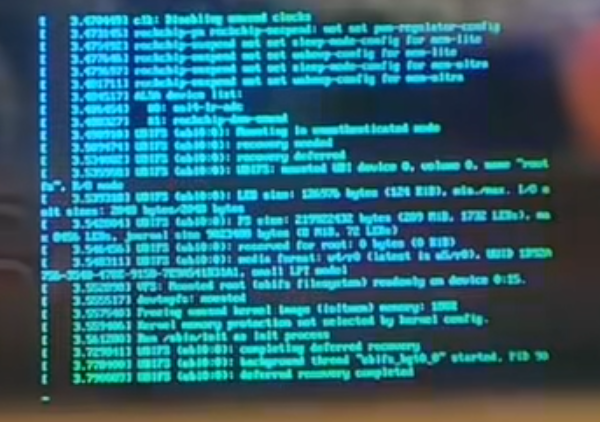
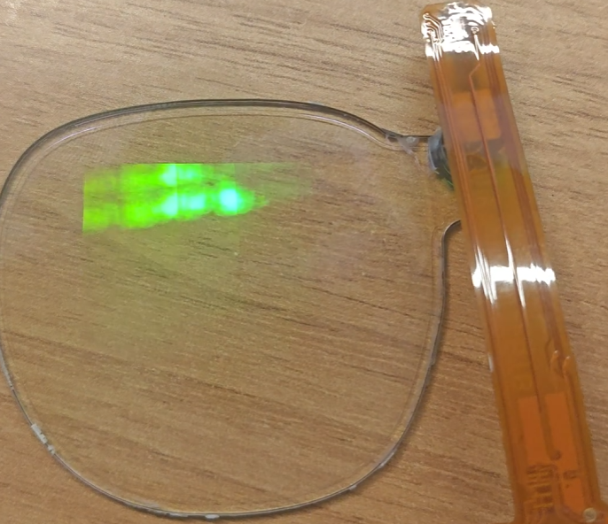
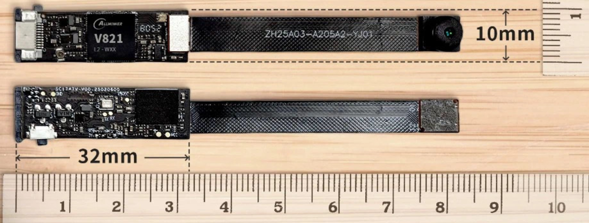
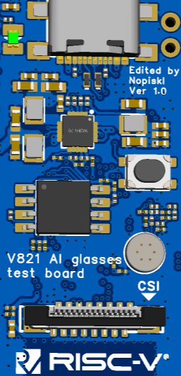

# V821 AI Glass

本仓库主要包含两套 V821 AI 眼镜相关方案：

1. `v821-aiglass`
2. `v821-aiglass_fastboot`

## 项目说明

### v821-aiglass

`v821-aiglass` 是面向完整 AI Glass 形态的板级配置方案，使用光波导模组，可实现较完整的专业 AI 眼镜设计。

当前支持能力：

- 接入大模型 API 与图片识别能力
- 支持 `320 x 640` 图像显示与文字显示
- 支持一键拍摄、录像等功能

由于整机体积限制，该方案目前已完成 testboard 板级验证与模组可行性验证，整机组装仍在推进中。

  
  
  

### v821-aiglass_fastboot

`v821-aiglass_fastboot` 是基于 fastboot 的快速启动方案。由于 fastboot 与 SoC 耦合较深，可开发自由度相对受限，大部分配置来自原厂方案。

该方案参考了全志公板 `board` 与索智 V821 AI 眼镜开发板，并非传统 Linux 启动流程。通过 fastboot 可实现快速抓图、拍照与录像，整体控制在 1 秒以内。

当前支持能力：

- 接入大模型 API 与语音识别能力
- 支持呼叫 AI、拍照转发、智能分析
- 支持一键拍摄、录像等功能

  

## 仓库目录

### Hardware_for_test

硬件测试相关内容，参考 AvaotaF1 设计版型。

当前提供了用于模组测试与功能验证的 testboard，适用于 `v821-aiglass`。后续会继续跟进更小尺寸的 PCB 设计，以便装入眼镜结构中。

  

### Application

应用程序相关内容，适用于 `v821-aiglass`。

当前提供了 LVGL / Qt 程序 demo，用于后续深度开发。目前 demo 主要用于功能验证，通用性较强，但尚未完全适配硬件。

### SDK/TinaLinux 5.0

SDK 补丁与板级配置相关内容，主要包含：

- `v821-aiglass`
- `v821-aiglass_fastboot`

## 补丁使用方法

将补丁文件复制到 SDK 对应目录下，后续可参考全志在线文档继续进行板级开发：

https://docs.aw-ol.com/docs/soc/v821/
